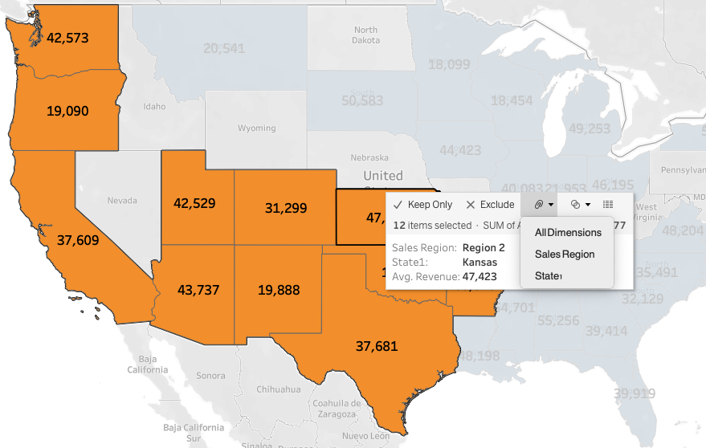

# Tableau Course from U-Demy
Tableau exercises for visualization 
- Module 1 - Installation of Tableau
    - Tableau Desktop: [https://www.tableau.com/products/desktop](https://www.tableau.com/products/desktop)
    - Tableau Public: [https://public.tableau.com/en-us/s/](https://public.tableau.com/en-us/s/)
- Module 2 - Tableau Basics: Your First Bar Chart
    - CSV files are considered text files in Tableau. This is because the CSV file is a comma separated value text file
    - Data is always broken up into "Dimensions" and "Measures":
        - Dimensions: Usually holds categorical/qualitative data. Can also be thought of as Independent variables
        - Measures: Usually holds numbered data. Can also be thought of as Dependent variables
        - Attributes can be dragged into the other data field but Tableau tries to figure it out on its own
    - You can create calculated fields by right clicking in the Measures tab and selecting calculated field. At this point you can drag the fields you want and the operation you want performed.
    - Quick Tip: When coloring the columns you can drag it from the top bar (column, row) and hold CMD (macOS) or CTRL (Windows, Linux) and it will append it without removing it from the column or row tab.
- Module 3 - Time series, Aggregation, and Filters
    - Extract feature in Tableau makes a copy of the dataset so you can manipulate it without making changes to the original. This is essentially a copy of the dataset
    - When working with time series Tableau's default functionality is that it will add up all of the months irrespective of year. So for example it will only have 12 columns even tho you might have several years of data. To change this you have to click the dropdown on the category and select the second set of year/month/day section.
        - This changes the **granularity** of the data (or the number of ticks on the timeline)
    - Dimensions dictate the granularity of the data Tableau displays
    - Aggregation turned off will plot the data row by row. This can be confusing because there can be a ton of data that is displayed and hard to read. Aggregation will sum up all of the data for a given interval and post it
    - To add points to the graph you can click on color.
    - Show Filter: Adds a quick filter toggle so its easier to switch between attributes
        - Filters are found within the dashboard function
    - Aggregation is always defaulted to the granularity of the workbook
- Module 4 - Maps, Scatterplots, and Your First Dashboard
    - When the excel sheet has multiple pages there will be no data loaded up by default. You have to drag the sheets into the datasource
    - On mac if you want to join the two sheets, you first drag one over and then double click the box that gets created. Then you drag the second one into it
    - The hierarchy in Tableau is an arrangement where entities are presented at various levels.
        - Example: Country-State-City
        - Can be created by dragging one element into the other and tableau will prompt you to name the hierarchy
    - Tableau has two types of actions. Filtering and Highlighting
        - Filters can be added by going to Dashboard and going down to "Actions"
        - Highlighting: The dataset is not filtered. So when you click on the datapoint it will not query the locations you requested and adjust the plots. It will instead just highlight which ones represent that data point without restructuring.
            - NOTE: IF YOU APPLIED A HIGHLIGHT AND NOTHING IS SHOWING UP, THIS IS PROBABLY DUE TO THE FACT THAT TABLEAU IS NOT ABLE TO SEPARATE MULTIPLE ENTRIES. THIS CAN BE FIXED BY ADJUSTING THE GRANULARITY.
        - ACTION FILTERS WORK AT THE DATA LEVEL THEY FILTER OUT THE DATA AND THAT DATA IS SUPPLIED TO THE REST OF THE WORKSHEETS. HIGHLIGHTING WORKING ON THE DATA AS A WHOLE AND CAN BE CHANGED WITH GRANULARITY
- Module 5 - Joining and Blending Data, PLUS: Dual Axis Charts
    - Types of Joins
        - Inner Join: Look at only the intersect of the two tables. So what is similar between both of the tables

            

        - Left Outer Join: Rows will only be discarded from the non-primary table. So this is the table that comes on the right side

            

        - Right Outer Join: Rows will be discarded from the non-primary table. So this is the table that comes on the left side

            

        - Full Outer Join: This will join the two tables and not discard any non-matching

            

    - When dealing with duplicates, based on the join the new table will have multiple
    - You can join on multiple columns. This can be done with the AND statement
    - For Blending: Probably need to do some extra reviewing
        - When using different datasources Tableau will not let you perform a join. You need to perform a blend instead
        - BLEND IS A LEFT JOIN!
    - Data blending is Tableau happens after aggregation is performed on the separate datasets.
- Module 6 - Table Calculations, Advanced Dashboards, Storytelling
    - To add a geographic role, we can use the dropdown menu
        - When doing this action the regions might not be recognized. For this you have to click on the "unknown" button that appears at the bottom
    - Creating bins converts the element into categorical
    - Parameters can be created by right clicking and creating a param. This will allow you to dynamically adjust the size.
        - Once a param has been created you need to link it to your bins by right clicking and editing the bin
    - Stories can be created. Stories control the flow of how the information is going to be shared. Each story "page" can only have one element in it. This can be a dashboard or each individual worksheet
- Module 7 - Advanced Data Preparation
    - When importing data into tableau you have to make sure that the data is as "raw" as possible. By this I mean that any extra headers and columns need to be deleted. If the data is pivoted then this needs to be undone as well. The data should be flowing vertical. Totals can also be deleted since tableau can do this as well
    - The Data Interpreter included in Tableau tries its best to clean up the data and remove the elements mentioned above.
        - The results can be viewed by clicking the "review" hyperlink after the data interpreter has been engaged.
        - Sometimes this is not enough and you have to manually edit the data set so it can be properly interpreted by Tableau
    - Data Cleaning Process
        - A new column can be created and headers can be moved to that column. If there are multiple rows with the same header value, then this should be added.
            - Example: You have 15 rows of U.S data, All of those rows should have the value of U.S
        - Totals can also be deleted since Tableau can easily calculate these for us
        - Doesn't work all the time so you should be using the "Review the results" to double check everything was imported properly
        - Data should be Pivoted. To do this, highlight the columns you want the action done and and in the dropdown select "Pivot"
        - Column splitting can also be useful
            - Example: You have customer names (both first and last name) in one column and you would like to split up into first and last name
            - Must specify separator and where you want the word split (first, last, all)
        - Table metadata can be accessed by clicking the following button

            

    - Percentages can be calculated using the "Table Calculation" in within the measure you want converted to percentages.
    - NOTE: For time-series data you need to add a filter. This can be done by dragging the variable into the filter section
    - Sometimes geographical data is not picked up due to several reasons. This can be fixed by manually editing in the locations by clicking on the "n unknown" area that pops up
- Module 8 - Clusters, Custom Territories, Design Features
    - Groups are used to create territories in Tableau. An example is having a company split up into two regions and pitting them against each other. You want to see which region out performs the other. So for your analytics you will group them together as a territory
        - Grouping can be done by holding down CTRL (CMD) and then clicking on the regions that will be grouped together. Then select the paperclip dropdown menu (or you can right click and select group)

            

        - The same can be done by creating a hierarchy by right clicking the field you want to combine → Geographic role and selecting the appropriate option.
        - Can quickly highlight by dragging into detail and selecting "Show Highlighter"
        - To save clusters you can hold CTRL (CMD) and drag it into dimension. This will create a new group
            - Useful for when we want to create new sheets based on the clustering
- Module 9 - What's new in Tableau
- Module 10 - Conclusion
